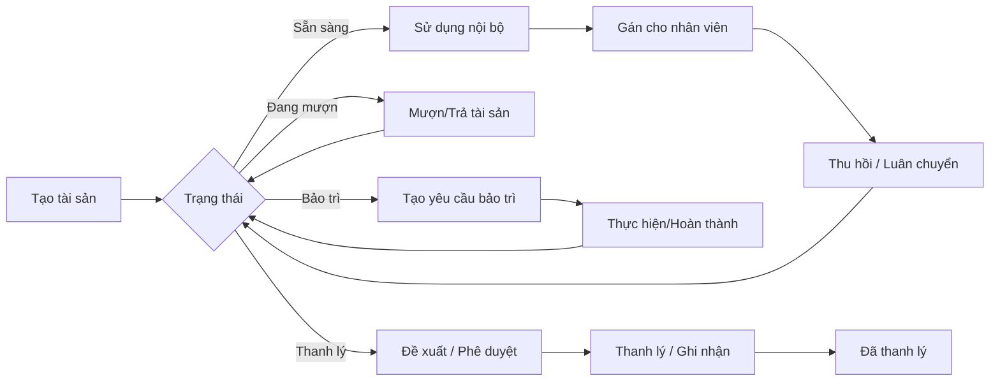
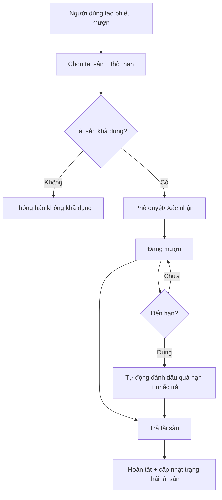
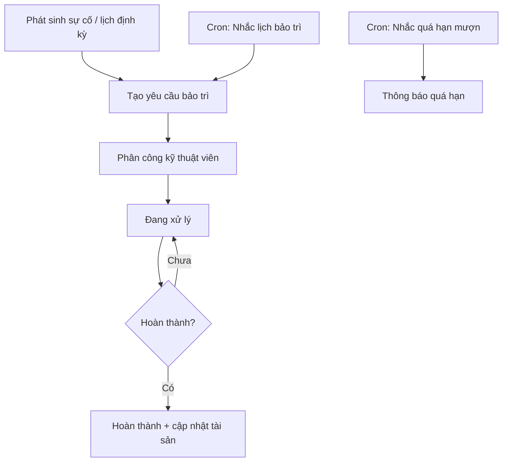
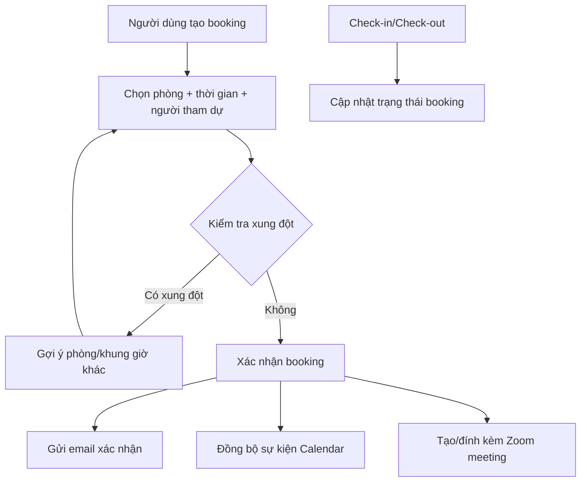
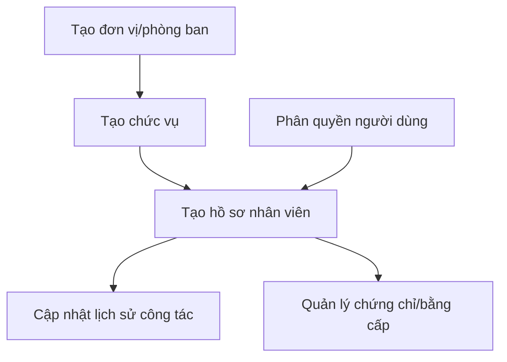

<h2 align="center">
    <a href="https://dainam.edu.vn/vi/khoa-cong-nghe-thong-tin">
    🎓 Faculty of Information Technology (DaiNam University)
    </a>
</h2>
<h2 align="center">
    PLATFORM ERP
</h2>
<div align="center">
    <p align="center">
        
        
        
    </p>

[](https://www.facebook.com/DNUAIoTLab)
[](https://dainam.edu.vn/vi/khoa-cong-nghe-thong-tin)
[](https://dainam.edu.vn)

</div>

## 📖 1. Giới thiệu
Platform ERP được áp dụng vào học phần Thực tập doanh nghiệp dựa trên mã nguồn mở Odoo. 

## 🔧 2. Các công nghệ được sử dụng
<div align="center">

### Hệ điều hành
[](https://ubuntu.com/)
### Công nghệ chính
[](https://www.odoo.com/)
[](https://www.python.org/)
[](https://developer.mozilla.org/en-US/docs/Web/JavaScript)
[](https://www.w3.org/XML/)
### Cơ sở dữ liệu
[](https://www.postgresql.org/)
</div>

## 🧩 3. Các phân hệ đã phát triển

### 3.1. Quản lý Tài sản & Phòng họp (dnu_meeting_asset)
Phân hệ quản lý toàn bộ vòng đời tài sản và điều phối lịch sử dụng phòng họp.

**Chức năng chính:**
- Danh mục tài sản, mã tài sản, vị trí, phòng họp, trạng thái tài sản.
- Gán tài sản cho nhân viên và theo dõi lịch sử gán.
- Mượn/Trả tài sản và theo dõi quá hạn.
- Bảo trì tài sản: tạo yêu cầu, theo dõi tiến độ, lịch bảo trì định kỳ.
- Biên bản bàn giao, kiểm kê, khấu hao và thanh lý tài sản.
- Dashboard tổng quan và báo cáo.
- Quản lý phòng họp, đặt lịch, kiểm tra xung đột và check-in/check-out.
- **AI hỗ trợ**: gợi ý bảo trì, phân tích nhanh thông tin tài sản/phòng họp (tích hợp OpenAI).
- **Tự động hóa**: nhắc lịch, tự động cập nhật trạng thái, xử lý quá hạn theo lịch tác vụ.
- **Tích hợp lịch**: đồng bộ lịch họp với Calendar.
- **Tích hợp họp trực tuyến**: kết nối Zoom cho lịch họp.

### 3.2. Quản lý Nhân sự (nhan_su)
Phân hệ quản lý thông tin nhân sự và cấu trúc tổ chức.

**Chức năng chính:**
- Danh mục chức vụ.
- Đơn vị/phòng ban.
- Hồ sơ nhân viên.
- Lịch sử công tác.
- Chứng chỉ/bằng cấp và danh sách chứng chỉ.
- Phân quyền truy cập theo vai trò.

### 3.3. Quản lý Văn bản (quan_ly_van_ban)
Phân hệ quản lý luồng văn bản đến/đi trong nội bộ.

**Chức năng chính:**
- Văn bản đến.
- Văn bản đi.
- Loại văn bản và danh mục liên quan.
- Liên kết văn bản với nhân viên/đơn vị.
- Cơ chế phân quyền và lịch nhắc việc theo tác vụ định kỳ.

### 3.4. Tích hợp giữa các phân hệ
- Tài sản được gán cho nhân sự và hiển thị lịch sử gán theo nhân viên.
- Văn bản liên kết nhân sự/đơn vị để thuận tiện theo dõi xử lý.
- Tài sản & phòng họp tích hợp với nhân sự và văn bản trong cùng hệ thống.
- AI và tự động hóa hỗ trợ thống nhất quy trình xử lý tài sản, lịch họp và văn bản.

### 3.5. Sơ đồ nghiệp vụ (Business Flow)
Ghi chú: Các sơ đồ bên dưới dùng Mermaid (GitHub/GitLab hỗ trợ hiển thị trực tiếp trong Markdown).

#### 3.5.1. Vòng đời tài sản (Asset Lifecycle)


#### 3.5.2. Quy trình mượn/trả tài sản (Lending)


#### 3.5.3. Quy trình bảo trì + tự động hóa (Maintenance & Automation)


#### 3.5.4. Đặt phòng họp + Calendar + Zoom


#### 3.5.5. Quản lý văn bản đến/đi (Document Flow)
```mermaid
flowchart TD
    D1[Văn bản đến] --> D2[Tiếp nhận + phân loại]
    D2 --> D3[Phân công xử lý (nhân viên/đơn vị)]
    D3 --> D4[Theo dõi tiến độ/nhắc việc (cron)]
    D4 --> D5[Hoàn tất + lưu trữ]

    E1[Văn bản đi] --> E2[Soạn thảo]
    E2 --> E3[Duyệt/ban hành]
    E3 --> E4[Phát hành + lưu trữ]
```

#### 3.5.6. Nhân sự (HR Core)


## 🚀 4. Các project đã thực hiện dựa trên Platform

Một số project sinh viên đã thực hiện:
- #### [Khoá 15](./docs/projects/K15/README.md)
- #### [Khoá 16]() (Coming soon)
## ⚙️ 5. Cài đặt

### 5.1. Cài đặt công cụ, môi trường và các thư viện cần thiết

#### 5.1.1. Tải project.
```
git clone https://gitlab.com/anhlta/odoo-fitdnu.git
```
#### 5.1.2. Cài đặt các thư viện cần thiết
Người sử dụng thực thi các lệnh sau đề cài đặt các thư viện cần thiết

```
sudo apt-get install libxml2-dev libxslt-dev libldap2-dev libsasl2-dev libssl-dev python3.10-distutils python3.10-dev build-essential libssl-dev libffi-dev zlib1g-dev python3.10-venv libpq-dev
```
#### 5.1.3. Khởi tạo môi trường ảo.
- Khởi tạo môi trường ảo
```
python3.10 -m venv ./venv
```
- Thay đổi trình thông dịch sang môi trường ảo
```
source venv/bin/activate
```
- Chạy requirements.txt để cài đặt tiếp các thư viện được yêu cầu
```
pip3 install -r requirements.txt
```
### 5.2. Setup database

Khởi tạo database trên docker bằng việc thực thi file dockercompose.yml.
```
sudo docker-compose up -d
```
### 5.3. Setup tham số chạy cho hệ thống
Tạo tệp **odoo.conf** có nội dung như sau:
```
[options]
addons_path = addons
db_host = localhost
db_password = odoo
db_user = odoo
db_port = 5431
xmlrpc_port = 8069
```
Có thể kế thừa từ file **odoo.conf.template**
### 5.4. Chạy hệ thống và cài đặt các ứng dụng cần thiết
Lệnh chạy
```
python3 odoo-bin.py -c odoo.conf -u all
```
Người sử dụng truy cập theo đường dẫn _http://localhost:8069/_ để đăng nhập vào hệ thống.

## 📝 6. License

© 2024 AIoTLab, Faculty of Information Technology, DaiNam University. All rights reserved.

---

    
