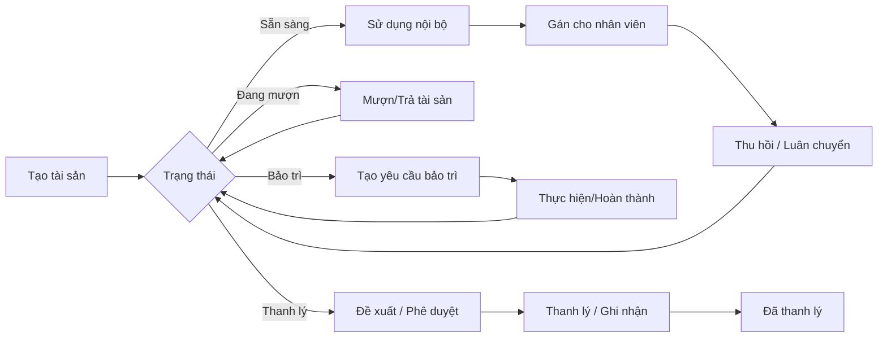
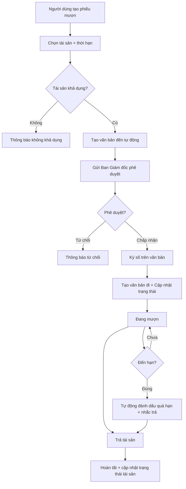
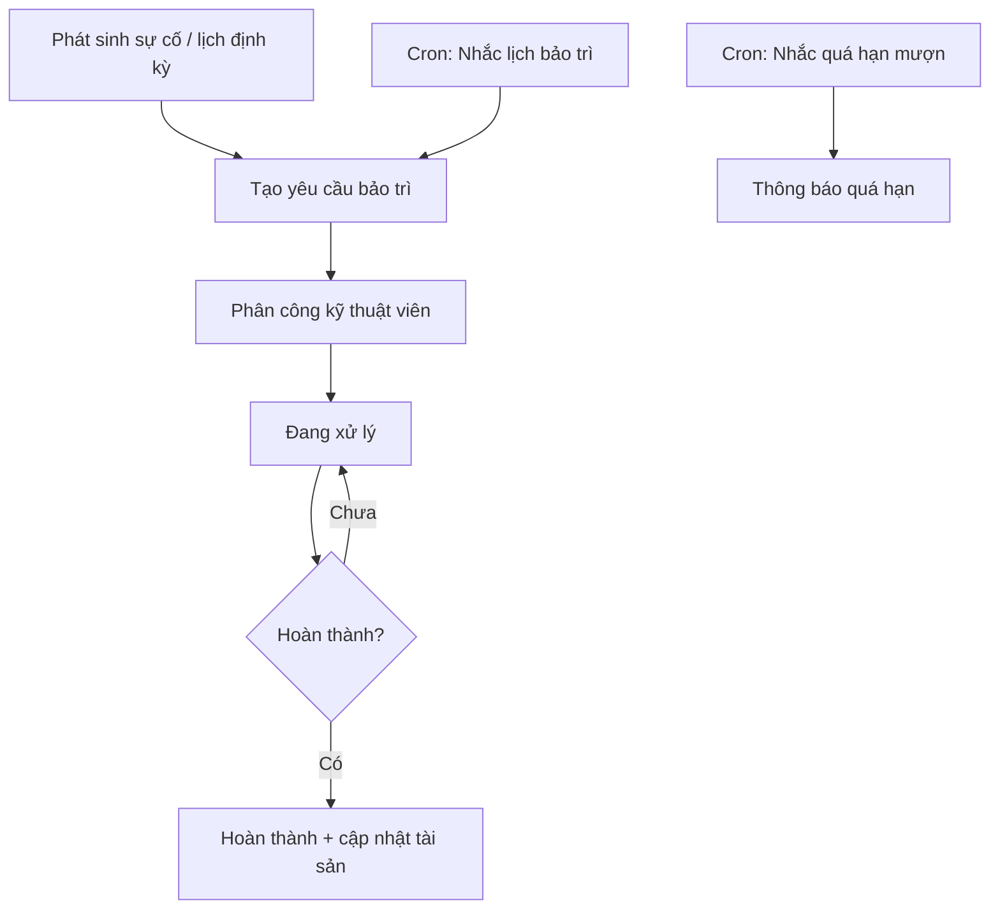
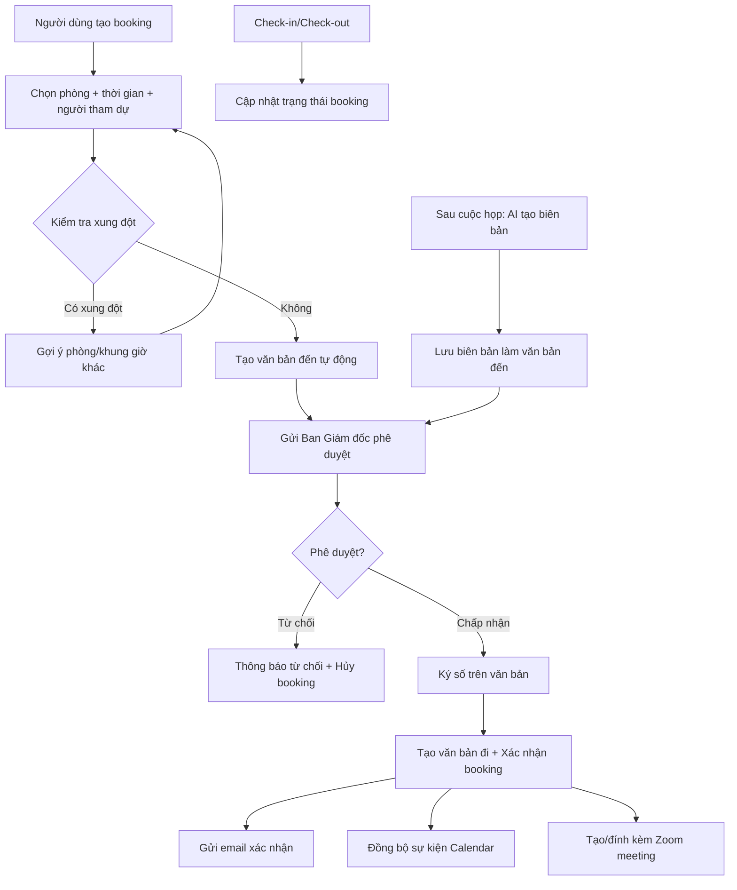
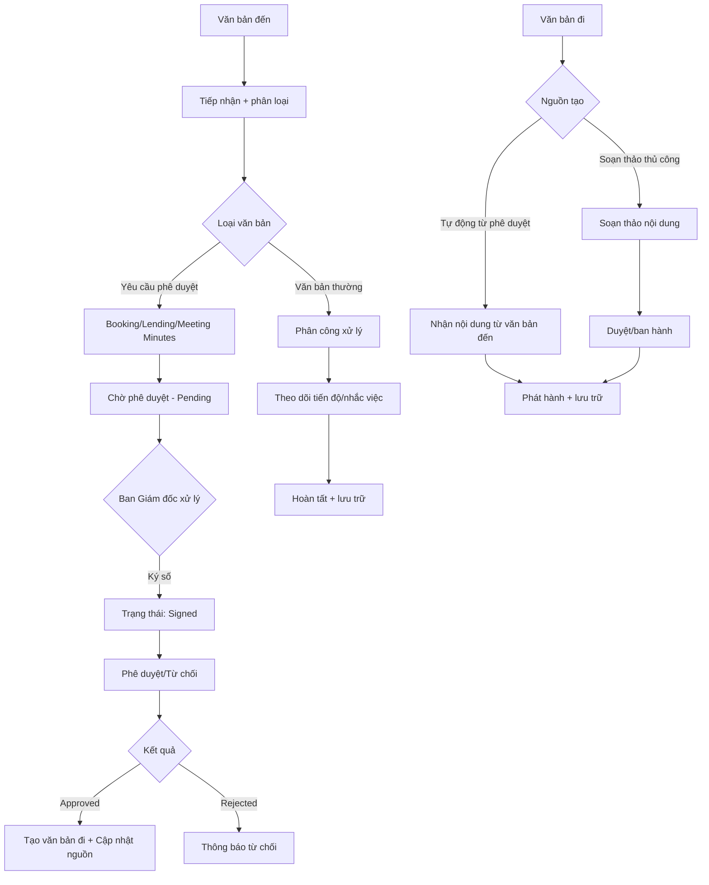
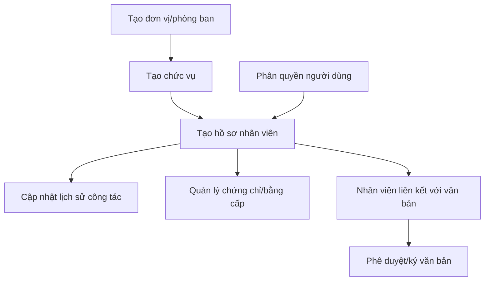
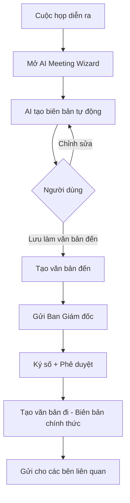

<h2 align="center">
    <a href="https://dainam.edu.vn/vi/khoa-cong-nghe-thong-tin">
    🎓 Faculty of Information Technology (DaiNam University)
    </a>
</h2>
<h2 align="center">
    PLATFORM ERP
</h2>
<div align="center">
    <p align="center">
        
        
        
    </p>

[](https://www.facebook.com/DNUAIoTLab)
[](https://dainam.edu.vn/vi/khoa-cong-nghe-thong-tin)
[](https://dainam.edu.vn)

</div>

## 📖 1. Giới thiệu
Platform ERP được áp dụng vào học phần Thực tập doanh nghiệp dựa trên mã nguồn mở Odoo. Hệ thống tích hợp đầy đủ các phân hệ quản lý tài sản, phòng họp, nhân sự và văn bản với quy trình phê duyệt tự động, chữ ký số và AI hỗ trợ thông minh. 

## 🔧 2. Các công nghệ được sử dụng
<div align="center">

### Hệ điều hành
[](https://ubuntu.com/)
### Công nghệ chính
[](https://www.odoo.com/)
[](https://www.python.org/)
[](https://developer.mozilla.org/en-US/docs/Web/JavaScript)
[](https://www.w3.org/XML/)
### Cơ sở dữ liệu
[](https://www.postgresql.org/)
</div>

## 🧩 3. Các phân hệ đã phát triển

### 3.1. Quản lý Tài sản & Phòng họp (dnu_meeting_asset)
Phân hệ quản lý toàn bộ vòng đời tài sản và điều phối lịch sử dụng phòng họp với quy trình phê duyệt tự động.

**Chức năng chính:**
- **Quản lý tài sản:**
  - Danh mục tài sản, mã tài sản, vị trí, trạng thái tài sản
  - Gán tài sản cho nhân viên và theo dõi lịch sử gán
  - Mượn/Trả tài sản với phê duyệt tự động
  - Bảo trì tài sản: tạo yêu cầu, theo dõi tiến độ, lịch bảo trì định kỳ
  - Biên bản bàn giao, kiểm kê, khấu hao và thanh lý tài sản
  - Dashboard tổng quan và báo cáo chi tiết

- **Quản lý phòng họp:**
  - Quản lý phòng họp, đặt lịch, kiểm tra xung đột thời gian
  - Check-in/Check-out tự động
  - **Quy trình phê duyệt**: tự động tạo văn bản đến khi đặt phòng, gửi Ban Giám đốc phê duyệt
  - Phê duyệt trực tiếp từ danh sách booking
  - Tự động tạo văn bản đi sau khi phê duyệt

- **AI hỗ trợ thông minh:**
  - Tạo biên bản cuộc họp tự động
  - Gợi ý thời gian họp phù hợp
  - Tạo agenda cuộc họp
  - Trò chuyện AI về quản lý tài sản/phòng họp
  - Lưu biên bản AI làm văn bản đến để ký duyệt
  - Tích hợp OpenAI GPT-4

- **Tự động hóa:**
  - Nhắc lịch bảo trì, quá hạn mượn tài sản
  - Tự động cập nhật trạng thái
  - Xử lý quá hạn theo lịch tác vụ định kỳ
  - Gửi thông báo email tự động

- **Tích hợp:**
  - Đồng bộ lịch họp với Calendar
  - Kết nối Zoom cho họp trực tuyến
  - Tích hợp với hệ thống văn bản đến/đi

### 3.2. Quản lý Nhân sự (nhan_su)
Phân hệ quản lý thông tin nhân sự và cấu trúc tổ chức.

**Chức năng chính:**
- Danh mục chức vụ.
- Đơn vị/phòng ban.
- Hồ sơ nhân viên.
- Lịch sử công tác.
- Chứng chỉ/bằng cấp và danh sách chứng chỉ.
- Phân quyền truy cập theo vai trò.

### 3.3. Quản lý Văn bản (quan_ly_van_ban)
Phân hệ quản lý luồng văn bản đến/đi với quy trình phê duyệt và chữ ký số.

**Chức năng chính:**
- **Văn bản đến:**
  - Tiếp nhận và phân loại văn bản
  - Phê duyệt yêu cầu đặt phòng/mượn tài sản
  - Phê duyệt biên bản cuộc họp do AI tạo
  - **Chữ ký số**: ký điện tử trên văn bản phê duyệt
  - Theo dõi trạng thái: pending → signed → approved
  - Tự động tạo văn bản đi sau khi phê duyệt

- **Văn bản đi:**
  - Soạn thảo và phát hành
  - Lưu nội dung văn bản chi tiết
  - Tự động nhận từ văn bản đến đã duyệt
  - Mã số tự động: YC/2026/xxxx, PD/2026/xxxx

- **Quy trình phê duyệt:**
  - Booking/Lending → Tạo văn bản đến → Gửi Ban Giám đốc
  - Phê duyệt + Ký số → Tạo văn bản đi → Cập nhật trạng thái nguồn
  - Thông báo email tự động cho người yêu cầu

- **Tính năng khác:**
  - Loại văn bản và danh mục
  - Liên kết với nhân viên/đơn vị
  - Phân quyền xử lý
  - Lịch nhắc việc định kỳ

### 3.4. Tích hợp giữa các phân hệ
- Tài sản được gán cho nhân sự và hiển thị lịch sử gán theo nhân viên
- Văn bản liên kết nhân sự/đơn vị để thuận tiện theo dõi xử lý
- **Quy trình phê duyệt tích hợp**: Booking/Lending tự động tạo văn bản đến cho phê duyệt
- **Chữ ký số**: Ban Giám đốc ký trực tiếp trên văn bản đến
- **AI tích hợp**: Biên bản cuộc họp AI → Văn bản đến → Ký duyệt → Văn bản đi
- AI và tự động hóa hỗ trợ thống nhất quy trình xử lý tài sản, lịch họp và văn bản

## 📸 4. Hình ảnh giao diện

### 4.1. Quản lý Tài sản
#### Danh sách tài sản
*[Hình ảnh sẽ được bổ sung]*

#### Chi tiết tài sản
*[Hình ảnh sẽ được bổ sung]*

#### Gán tài sản cho nhân viên
*[Hình ảnh sẽ được bổ sung]*

#### Lịch sử tài sản
*[Hình ảnh sẽ được bổ sung]*

### 4.2. Quản lý Phòng họp
#### Danh sách phòng họp
*[Hình ảnh sẽ được bổ sung]*

#### Đặt lịch phòng họp
*[Hình ảnh sẽ được bổ sung]*

#### Lịch họp (Calendar View)
*[Hình ảnh sẽ được bổ sung]*

#### Yêu cầu phê duyệt phòng họp
*[Hình ảnh sẽ được bổ sung]*

### 4.3. Quản lý Văn bản
#### Văn bản đến - Danh sách
*[Hình ảnh sẽ được bổ sung]*

#### Văn bản đến - Chi tiết
*[Hình ảnh sẽ được bổ sung]*

#### Chữ ký số
*[Hình ảnh sẽ được bổ sung]*

#### Văn bản đi - Danh sách
*[Hình ảnh sẽ được bổ sung]*

#### Văn bản đi - Chi tiết
*[Hình ảnh sẽ được bổ sung]*

### 4.4. AI Assistant
#### AI Wizard - Tạo biên bản cuộc họp
*[Hình ảnh sẽ được bổ sung]*

#### AI Wizard - Gợi ý thời gian họp
*[Hình ảnh sẽ được bổ sung]*

#### AI Wizard - Tạo Agenda
*[Hình ảnh sẽ được bổ sung]*

#### AI Chat
*[Hình ảnh sẽ được bổ sung]*

#### Lưu biên bản AI làm văn bản đến
*[Hình ảnh sẽ được bổ sung]*

### 4.5. Quy trình phê duyệt
#### Tạo yêu cầu phê duyệt
*[Hình ảnh sẽ được bổ sung]*

#### Phê duyệt từ danh sách
*[Hình ảnh sẽ được bổ sung]*

#### Ký số văn bản
*[Hình ảnh sẽ được bổ sung]*

#### Văn bản đi sau phê duyệt
*[Hình ảnh sẽ được bổ sung]*

### 4.6. Dashboard & Báo cáo
#### Dashboard tài sản
*[Hình ảnh sẽ được bổ sung]*

#### Báo cáo phòng họp
*[Hình ảnh sẽ được bổ sung]*

#### Thống kê văn bản
*[Hình ảnh sẽ được bổ sung]*

### 4.7. Tích hợp
#### Tích hợp Zoom
*[Hình ảnh sẽ được bổ sung]*

#### Tích hợp Calendar
*[Hình ảnh sẽ được bổ sung]*

#### Tích hợp OpenAI
*[Hình ảnh sẽ được bổ sung]*

### 3.5. Sơ đồ nghiệp vụ (Business Flow)
Ghi chú: Các sơ đồ bên dưới dùng Mermaid (GitHub/GitLab hỗ trợ hiển thị trực tiếp trong Markdown).

#### 3.5.1. Vòng đời tài sản (Asset Lifecycle)


#### 3.5.2. Quy trình mượn/trả tài sản với phê duyệt (Lending with Approval)


#### 3.5.3. Quy trình bảo trì + tự động hóa (Maintenance & Automation)


#### 3.5.4. Đặt phòng họp + Phê duyệt + AI + Calendar + Zoom


#### 3.5.5. Quản lý văn bản với chữ ký số (Document Flow with Digital Signature)


#### 3.5.6. Nhân sự (HR Core)


#### 3.5.7. AI Workflow - Biên bản cuộc họp


## 🚀 4. Các project đã thực hiện dựa trên Platform

Một số project sinh viên đã thực hiện:
- #### [Khoá 15](./docs/projects/K15/README.md)
- #### [Khoá 16]() (Coming soon)

## ⭐ 5. Tính năng nổi bật

### 5.1. Quy trình phê duyệt tự động
- Tự động tạo văn bản đến khi có yêu cầu đặt phòng/mượn tài sản
- Gửi thông báo đến Ban Giám đốc để phê duyệt
- Chữ ký số trực tiếp trên văn bản
- Tự động tạo văn bản đi sau khi phê duyệt
- Cập nhật trạng thái nguồn tự động (booking/lending)

### 5.2. Chữ ký số (Digital Signature)
- Ký điện tử trực tiếp trên giao diện
- Lưu chữ ký kèm thời gian
- Xác thực người ký qua tài khoản
- Liên kết với phòng ban người ký

### 5.3. AI Assistant thông minh
- **Tạo biên bản cuộc họp tự động**: AI phân tích thông tin cuộc họp và tạo biên bản hoàn chỉnh
- **Gợi ý thời gian họp**: Dựa trên lịch của người tham dự, AI đề xuất khung giờ phù hợp
- **Tạo Agenda cuộc họp**: Tự động tạo nội dung chương trình họp
- **AI Chat**: Trò chuyện về quản lý tài sản, phòng họp, nhân sự
- **Lưu biên bản làm văn bản**: Chuyển biên bản AI thành văn bản đến để ký duyệt
- Tích hợp OpenAI GPT-4 với API key riêng

### 5.4. Tự động hóa quy trình
- Tự động nhắc lịch bảo trì tài sản
- Tự động cảnh báo quá hạn mượn tài sản
- Tự động cập nhật trạng thái booking/lending
- Tự động gửi email thông báo
- Tự động đồng bộ lịch Calendar
- Tự động tạo Zoom meeting

### 5.5. Tích hợp đa nền tảng
- **Calendar**: Đồng bộ lịch họp với Google Calendar
- **Zoom**: Tự động tạo link họp trực tuyến
- **OpenAI**: Tích hợp GPT-4 cho AI features
- **Email**: Gửi thông báo tự động
- **Chữ ký số**: Widget vẽ chữ ký trực tiếp
## ⚙️ 6. Cài đặt

### 6.1. Yêu cầu hệ thống
- **Hệ điều hành**: Ubuntu 20.04+ hoặc tương đương
- **Python**: 3.10
- **PostgreSQL**: 12+
- **RAM**: Tối thiểu 4GB (khuyến nghị 8GB+)
- **Dung lượng**: Tối thiểu 10GB

### 6.2. Cài đặt công cụ, môi trường và các thư viện cần thiết

#### 6.2.1. Tải project
```bash
git clone https://gitlab.com/anhlta/odoo-fitdnu.git
cd odoo-fitdnu
```

#### 6.2.2. Cài đặt các thư viện cần thiết
```bash
sudo apt-get update
sudo apt-get install -y \
    libxml2-dev \
    libxslt-dev \
    libldap2-dev \
    libsasl2-dev \
    libssl-dev \
    python3.10-distutils \
    python3.10-dev \
    build-essential \
    libffi-dev \
    zlib1g-dev \
    python3.10-venv \
    libpq-dev \
    wkhtmltopdf
```

#### 6.2.3. Khởi tạo môi trường ảo
```bash
# Khởi tạo môi trường ảo
python3.10 -m venv ./venv

# Kích hoạt môi trường ảo
source venv/bin/activate

# Cài đặt các thư viện Python
pip3 install --upgrade pip
pip3 install -r requirements.txt
```

### 6.3. Setup database

#### 6.3.1. Cài đặt Docker (nếu chưa có)
```bash
sudo apt-get install docker.io docker-compose
sudo systemctl start docker
sudo systemctl enable docker
```

#### 6.3.2. Khởi tạo database PostgreSQL
```bash
sudo docker-compose up -d
```

### 6.4. Setup tham số chạy cho hệ thống
Tạo tệp **odoo.conf** từ template:
```bash
cp odoo.conf.template odoo.conf
```

Nội dung file **odoo.conf**:
```ini
[options]
addons_path = addons
db_host = localhost
db_password = odoo
db_user = odoo
db_port = 5431
xmlrpc_port = 8069
limit_time_cpu = 600
limit_time_real = 1200
workers = 2
```

### 6.5. Cấu hình OpenAI (cho AI features)
1. Đăng nhập vào Odoo
2. Vào **Settings → OpenAI Configuration**
3. Nhập API Key của OpenAI
4. Chọn model: `gpt-4` hoặc `gpt-3.5-turbo`
5. Lưu cấu hình

### 6.6. Chạy hệ thống

#### 6.6.1. Khởi động lần đầu (tạo database)
```bash
./odoo-bin -c odoo.conf -d database_name -i base,nhan_su,quan_ly_van_ban,dnu_meeting_asset
```

#### 6.6.2. Chạy bình thường
```bash
./odoo-bin -c odoo.conf
```

#### 6.6.3. Upgrade module sau khi có thay đổi
```bash
./odoo-bin -c odoo.conf -d database_name -u dnu_meeting_asset --stop-after-init
```

### 6.7. Truy cập hệ thống
- URL: http://localhost:8069
- Database: database_name
- Tài khoản mặc định: admin / admin

### 6.8. Cấu hình tích hợp

#### 6.8.1. Tích hợp Zoom
1. Vào **Settings → Integrations → Zoom**
2. Nhập API Key và API Secret từ Zoom
3. Kích hoạt tích hợp

#### 6.8.2. Tích hợp Google Calendar
1. Vào **Settings → Integrations → Google Calendar**
2. Cấu hình OAuth2 credentials
3. Kết nối tài khoản Google

#### 6.8.3. Cấu hình Email Server
1. Vào **Settings → Technical → Outgoing Mail Servers**
2. Nhập thông tin SMTP server
3. Test connection

## 📚 7. Hướng dẫn sử dụng

### 7.1. Quy trình đặt phòng họp có phê duyệt
1. **Tạo booking**: Vào **Phòng họp → Đặt lịch họp**
2. Chọn phòng, thời gian, người tham dự
3. Hệ thống tự động tạo **văn bản đến** gửi Ban Giám đốc
4. Ban Giám đốc vào **Văn bản đến**, ký số và phê duyệt
5. Hệ thống tự động:
   - Tạo văn bản đi
   - Cập nhật trạng thái booking → Confirmed
   - Gửi email xác nhận
   - Đồng bộ Calendar
   - Tạo Zoom meeting

### 7.2. Sử dụng AI tạo biên bản cuộc họp
1. Sau cuộc họp, mở **AI Meeting Wizard**
2. Chọn **Tạo biên bản cuộc họp**
3. Nhập ghi chú cuộc họp (nếu có)
4. AI sẽ tạo biên bản hoàn chỉnh
5. Click **Lưu làm văn bản đến**
6. Văn bản đến được gửi Ban Giám đốc để ký
7. Sau khi ký duyệt, biên bản chính thức được tạo ở **Văn bản đi**

### 7.3. Phê duyệt nhanh từ danh sách
1. Vào **Phòng họp → Danh sách booking**
2. Tìm booking cần phê duyệt (trạng thái Pending)
3. Click nút **Duyệt** hoặc **Từ chối** trực tiếp
4. Nhập lý do (nếu từ chối)
5. Hệ thống tự động cập nhật văn bản và gửi thông báo

### 7.4. Mượn tài sản với phê duyệt
1. Vào **Tài sản → Mượn tài sản**
2. Chọn tài sản và thời hạn
3. Hệ thống tự động tạo văn bản đến
4. Ban Giám đốc phê duyệt và ký
5. Tài sản chuyển sang trạng thái "Đang mượn"
6. Hệ thống nhắc trả khi đến hạn

## � 8. Cấu trúc dự án

```
Business-Internship/
├── addons/                          # Custom modules
│   ├── nhan_su/                     # Phân hệ quản lý nhân sự
│   │   ├── models/                  # Models (chuc_vu, don_vi, nhan_vien, etc.)
│   │   ├── views/                   # XML views
│   │   ├── security/                # Access rights, record rules
│   │   └── data/                    # Master data
│   │
│   ├── quan_ly_van_ban/             # Phân hệ quản lý văn bản
│   │   ├── models/
│   │   │   ├── van_ban_den.py      # Văn bản đến + approval workflow
│   │   │   ├── van_ban_di.py       # Văn bản đi
│   │   │   └── van_ban_task.py     # Task reminder
│   │   ├── wizards/
│   │   │   └── van_ban_sign_wizard.py  # Digital signature wizard
│   │   ├── views/                   # Views với chữ ký số
│   │   └── data/
│   │       └── sequence.xml         # YC/2026/xxxx, PD/2026/xxxx
│   │
│   └── dnu_meeting_asset/           # Phân hệ tài sản & phòng họp
│       ├── models/
│       │   ├── dnu_asset.py         # Quản lý tài sản
│       │   ├── dnu_meeting_booking.py  # Đặt phòng + approval
│       │   ├── dnu_asset_lending.py    # Mượn tài sản + approval
│       │   ├── openai_service.py    # OpenAI integration
│       │   └── ai_history.py        # AI request logging
│       ├── wizards/
│       │   └── ai_wizard.py         # AI Meeting/HR Wizard
│       ├── views/
│       │   ├── dnu_meeting_booking_views.xml
│       │   ├── ai_wizard_views.xml
│       │   └── ai_history_views.xml
│       ├── data/
│       │   └── openai_data.xml      # Default OpenAI config
│       └── static/
│           └── src/
│               └── js/
│                   └── signature_widget.js  # Signature widget
│
├── odoo/                            # Odoo core files
├── debian/                          # Debian packaging
├── doc/                             # Documentation
├── docs/                            # Project documentation
│   ├── logo/                        # Logos
│   └── projects/                    # Student projects
│       └── K15/
├── setup/                           # Setup scripts
├── static/                          # Static files
├── odoo-bin                         # Odoo executable
├── odoo.conf                        # Configuration file
├── docker-compose.yml               # Docker setup for PostgreSQL
├── requirements.txt                 # Python dependencies
└── README.md                        # This file
```

## 🔐 9. Phân quyền

### 9.1. Groups đã định nghĩa

#### Phân hệ Tài sản & Phòng họp (dnu_meeting_asset)
- **Meeting User**: Người dùng thông thường, đặt phòng họp
- **Meeting Manager**: Quản lý phòng họp, phê duyệt
- **Asset User**: Người dùng tài sản, mượn tài sản
- **Asset Manager**: Quản lý tài sản, bảo trì

#### Phân hệ Văn bản (quan_ly_van_ban)
- **Document User**: Xem văn bản
- **Document Manager**: Quản lý văn bản đến/đi
- **Document Approver**: Phê duyệt và ký văn bản (Ban Giám đốc)

#### Phân hệ Nhân sự (nhan_su)
- **HR User**: Xem thông tin nhân sự
- **HR Manager**: Quản lý toàn bộ nhân sự

### 9.2. Quyền đặc biệt
- **Chữ ký số**: Chỉ Document Approver (Ban Giám đốc) mới có quyền ký
- **Phê duyệt booking/lending**: Document Approver
- **Tạo văn bản đi**: Tự động sau phê duyệt, hoặc Document Manager tạo thủ công

## 🧪 10. Testing

### 10.1. Test quy trình phê duyệt
```bash
# 1. Tạo test data
./odoo-bin -c odoo.conf -d test_db --test-enable --stop-after-init

# 2. Test booking approval
# - Tạo booking → Kiểm tra văn bản đến tự động
# - Ký và duyệt → Kiểm tra văn bản đi + cập nhật booking

# 3. Test lending approval
# - Tạo lending → Kiểm tra văn bản đến
# - Duyệt → Kiểm tra cập nhật trạng thái tài sản
```

### 10.2. Test AI features
```bash
# Test OpenAI connection
# 1. Vào Settings → OpenAI Configuration
# 2. Click "Test Connection"
# 3. Thử tạo biên bản cuộc họp
# 4. Kiểm tra AI History logs
```

## 🐛 11. Troubleshooting

### 11.1. Lỗi thường gặp

#### Không kết nối được database
```bash
# Kiểm tra PostgreSQL đang chạy
sudo docker ps

# Kiểm tra port
sudo netstat -tulpn | grep 5431

# Restart container
sudo docker-compose restart
```

#### Module không load
```bash
# Upgrade module
./odoo-bin -c odoo.conf -d database_name -u module_name --stop-after-init

# Clear cache
rm -rf ~/.local/share/Odoo/sessions/*

# Restart Odoo
```

#### OpenAI không hoạt động
```bash
# 1. Kiểm tra API Key đã cấu hình
# 2. Kiểm tra kết nối internet
# 3. Kiểm tra logs
tail -f /var/log/odoo/odoo.log

# 4. Test API key thủ công
curl https://api.openai.com/v1/models \
  -H "Authorization: Bearer YOUR_API_KEY"
```

#### Chữ ký không hiển thị
```bash
# Clear browser cache
# Kiểm tra JavaScript console
# Upgrade module
./odoo-bin -c odoo.conf -d database_name -u quan_ly_van_ban --stop-after-init
```

## 📈 12. Performance & Optimization

### 12.1. Database optimization
```sql
-- Reindex database
REINDEX DATABASE database_name;

-- Vacuum analyze
VACUUM ANALYZE;

-- Check database size
SELECT pg_database.datname, 
       pg_size_pretty(pg_database_size(pg_database.datname)) AS size
FROM pg_database;
```

### 12.2. Odoo optimization
```ini
# odoo.conf - Production settings
[options]
workers = 4
max_cron_threads = 2
limit_memory_hard = 2684354560
limit_memory_soft = 2147483648
limit_time_cpu = 600
limit_time_real = 1200
```

## 🤝 13. Contributing

### 13.1. Quy tắc code
- Follow PEP 8 for Python
- Use meaningful variable names
- Comment code khi cần thiết
- Write docstrings for functions/methods
- Test trước khi commit

### 13.2. Git workflow
```bash
# 1. Tạo branch mới
git checkout -b feature/ten-tinh-nang

# 2. Commit changes
git add .
git commit -m "feat: mô tả thay đổi"

# 3. Push to GitLab
git push origin feature/ten-tinh-nang

# 4. Tạo Merge Request
```

### 13.3. Commit message format
```
feat: Thêm tính năng mới
fix: Sửa lỗi
docs: Cập nhật documentation
style: Format code
refactor: Tái cấu trúc code
test: Thêm tests
chore: Cập nhật dependencies
```

## 📞 14. Support & Contact

- **Email**: aiotlab@dainam.edu.vn
- **Facebook**: [AIoTLab DNU](https://www.facebook.com/DNUAIoTLab)
- **Website**: [DaiNam University](https://dainam.edu.vn)
- **GitLab**: [odoo-fitdnu](https://gitlab.com/anhlta/odoo-fitdnu)

## �📝 6. License

© 2024 AIoTLab, Faculty of Information Technology, DaiNam University. All rights reserved.

---

    
