<h2 align="center">
    <a href="https://dainam.edu.vn/vi/khoa-cong-nghe-thong-tin">
    🎓 Faculty of Information Technology (DaiNam University)
    </a>
</h2>
<h2 align="center">
    HỆ THỐNG QUẢN LÝ TÀI SẢN VÀ PHÒNG HỌP
</h2>
<div align="center">
    <p align="center">
        
        
        
    </p>

[](https://www.facebook.com/DNUAIoTLab)
[](https://dainam.edu.vn/vi/khoa-cong-nghe-thong-tin)
[](https://dainam.edu.vn)

</div>

---

<div align="center">

## 🎨 Project Poster


</div>

---

## 📖 1. Giới thiệu

> **Platform ERP thông minh** - Giải pháp toàn diện cho học phần Thực tập doanh nghiệp

Platform ERP được xây dựng trên nền tảng **Odoo** mã nguồn mở, tích hợp các công nghệ tiên tiến như **AI**, **Chữ ký số**, và **Tự động hóa quy trình**. Hệ thống cung cấp giải pháp quản lý tích hợp cho:

<table>
<tr>
<td width="25%" align="center">

<br><strong>Tài sản</strong>
<br><small>Quản lý vòng đời</small>
</td>
<td width="25%" align="center">

<br><strong>Phòng họp</strong>
<br><small>Đặt lịch thông minh</small>
</td>
<td width="25%" align="center">

<br><strong>Nhân sự</strong>
<br><small>Quản lý tổ chức</small>
</td>
<td width="25%" align="center">

<br><strong>Văn bản</strong>
<br><small>Luồng phê duyệt</small>
</td>
</tr>
</table>

### ✨ Điểm nổi bật

```
🤖 AI Assistant         → Tạo biên bản, gợi ý thời gian họp tự động
🔐 Chữ ký số            → Phê duyệt điện tử, xác thực người ký
⚡ Tự động hóa          → Quy trình phê duyệt, nhắc việc thông minh
🔗 Tích hợp đa nền tảng → Zoom, Google Calendar, Email
```

---

## 🔧 2. Tech Stack

<div align="center">

| Loại | Công nghệ |
|------|-----------|
| **Platform** | [](https://www.odoo.com/) |
| **Backend** | [](https://www.python.org/) |
| **Frontend** | [](https://developer.mozilla.org/en-US/docs/Web/JavaScript) [](https://www.w3.org/XML/) |
| **Database** | [](https://www.postgresql.org/) |
| **AI** | [](https://openai.com/) |
| **DevOps** | [](https://www.docker.com/) [](https://ubuntu.com/) |

</div>

---

## 🧩 3. Tổng quan các Module

<details open>
<summary><h3>📦 3.1. Asset & Meeting Management (dnu_meeting_asset)</h3></summary>

> **Module quản lý tài sản và phòng họp với AI và tự động hóa**

#### 🔹 Quản lý Tài sản

| Tính năng | Mô tả |
|-----------|-------|
| **📋 Danh mục** | Quản lý danh mục, mã tài sản, vị trí, trạng thái |
| **👥 Gán tài sản** | Gán cho nhân viên, theo dõi lịch sử gán |
| **🔄 Mượn/Trả** | Quy trình phê duyệt tự động, nhắc quá hạn |
| **🔧 Bảo trì** | Tạo yêu cầu, phân công kỹ thuật viên, lịch định kỳ |
| **📊 Báo cáo** | Dashboard tổng quan, báo cáo chi tiết, thống kê |

#### 🔹 Quản lý Phòng họp

```
┌─────────────────────────────────────────────────────────┐
│  Đặt lịch → Kiểm tra xung đột → Phê duyệt tự động      │
│     ↓              ↓                    ↓               │
│  Calendar      Zoom Link          Email thông báo      │
└─────────────────────────────────────────────────────────┘
```

| Tính năng | Chi tiết |
|-----------|----------|
| ✅ **Smart Booking** | Kiểm tra xung đột thời gian, gợi ý phòng/khung giờ khác |
| ✅ **Approval Flow** | Tự động tạo văn bản đến → Phê duyệt → Văn bản đi |
| ✅ **Check-in/out** | Tự động cập nhật trạng thái, theo dõi sử dụng |
| ✅ **Integration** | Zoom meeting, Google Calendar, Email notification |

#### 🔹 AI Assistant

| AI Feature | Công dụng |
|------------|-----------|
| 🤖 **Meeting Minutes** | Tạo biên bản cuộc họp tự động từ thông tin booking |
| 🕒 **Smart Scheduling** | Gợi ý thời gian họp dựa trên lịch người tham dự |
| 📝 **Agenda Generator** | Tạo chương trình họp chi tiết |
| 💬 **AI Chat** | Trợ lý ảo tư vấn quản lý tài sản/phòng họp |
| 📄 **Document Flow** | Chuyển biên bản AI thành văn bản chính thức |

</details>

<details>
<summary><h3>👥 3.2. Human Resource Management (nhan_su)</h3></summary>

> **Quản lý nhân sự và cấu trúc tổ chức**

#### Tính năng chính

<table>
<tr>
<td width="33%">

**🏢 Cấu trúc tổ chức**
- Đơn vị/Phòng ban
- Chức vụ/Vị trí
- Cấp bậc quản lý

</td>
<td width="33%">

**📇 Hồ sơ nhân viên**
- Thông tin cá nhân
- Lịch sử công tác
- Chứng chỉ/Bằng cấp

</td>
<td width="33%">

**🔐 Phân quyền**
- Vai trò người dùng
- Quyền truy cập
- Quy trình phê duyệt

</td>
</tr>
</table>

</details>

<details>
<summary><h3>📄 3.3. Document Management (quan_ly_van_ban)</h3></summary>

> **Quản lý văn bản với chữ ký số và quy trình phê duyệt tự động**

#### 📥 Văn bản đến

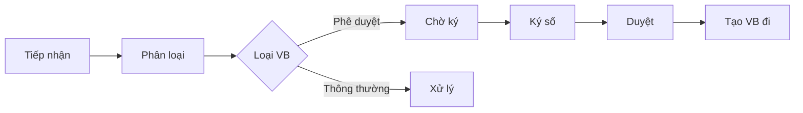

| Chức năng | Mô tả |
|-----------|-------|
| 📨 **Tiếp nhận** | Phân loại văn bản đến, gán người xử lý |
| ✍️ **Chữ ký số** | Ký điện tử với xác thực người ký |
| 📊 **Theo dõi** | Trạng thái: `pending` → `signed` → `approved` |
| 🔗 **Liên kết** | Kết nối với booking/lending để phê duyệt |

#### 📤 Văn bản đi

| Nguồn tạo | Quy trình |
|-----------|-----------|
| 🤖 **Tự động** | Từ văn bản đến đã phê duyệt (mã: `PD/2026/xxxx`) |
| ✏️ **Thủ công** | Soạn thảo, duyệt, phát hành (mã: `YC/2026/xxxx`) |

#### 🔄 Workflow tích hợp

```
Booking/Lending Request
         ↓
   Văn bản đến (YC/2026/xxxx)
         ↓
    Ký số + Phê duyệt
         ↓
   Văn bản đi (PD/2026/xxxx)
         ↓
   Cập nhật trạng thái nguồn
```

</details>

<details>
<summary><h3>🔗 3.4. Integration & Automation</h3></summary>

> **Tích hợp liên thông giữa các phân hệ**

#### Sơ đồ tích hợp

```
┌─────────────┐     ┌─────────────┐     ┌─────────────┐
│   Nhân sự   │────▶│  Văn bản    │◀────│  Tài sản    │
└─────────────┘     └─────────────┘     └─────────────┘
       │                    │                    │
       └────────────────────┼────────────────────┘
                            │
                       ┌────▼────┐
                       │   AI    │
                       └─────────┘
```

#### Các luồng tích hợp

| Luồng | Mô tả |
|-------|-------|
| 🎯 **Asset ↔ HR** | Gán tài sản cho nhân viên, lịch sử gán |
| 📋 **Meeting ↔ Document** | Booking → Văn bản đến → Phê duyệt → Văn bản đi |
| 🤖 **AI ↔ Document** | Biên bản AI → Văn bản đến → Ký duyệt |
| 📧 **Email Notification** | Tự động gửi thông báo cho các bên liên quan |

</details>

---

## 📸 4. Screenshots & UI Preview

> 📌 *Giao diện trực quan và thân thiện với người dùng*

<table>
<tr>
<td colspan="2" align="center">

### 🏢 Asset Management

</td>
</tr>
<tr>
<td width="50%">

**📋 Danh sách tài sản**
- Grid view với filters
- Quick search & export
- Status indicators

*[Screenshot coming soon]*

</td>
<td width="50%">

**📝 Chi tiết tài sản**
- Full asset information
- Assignment history
- Maintenance logs

*[Screenshot coming soon]*

</td>
</tr>
<tr>
<td colspan="2" align="center">

### 📅 Meeting Room Management

</td>
</tr>
<tr>
<td width="50%">

**🗓️ Calendar View**
- Visual booking calendar
- Conflict detection
- Drag & drop support

*[Screenshot coming soon]*

</td>
<td width="50%">

**✅ Approval Workflow**
- Quick approve/reject
- Digital signature
- Status tracking

*[Screenshot coming soon]*

</td>
</tr>
<tr>
<td colspan="2" align="center">

### 📄 Document Management

</td>
</tr>
<tr>
<td width="50%">

**📥 Incoming Documents**
- Document list with filters
- Approval status
- Digital signature widget

*[Screenshot coming soon]*

</td>
<td width="50%">

**📤 Outgoing Documents**
- Auto-generated from approvals
- Document code: YC/PD
- Archive & search

*[Screenshot coming soon]*

</td>
</tr>
<tr>
<td colspan="2" align="center">

### 🤖 AI Assistant Features

</td>
</tr>
<tr>
<td width="50%">

**🧙 AI Wizard**
- Meeting minutes generator
- Smart scheduling
- Agenda creator

*[Screenshot coming soon]*

</td>
<td width="50%">

**💬 AI Chat Interface**
- Natural language queries
- Context-aware responses
- History tracking

*[Screenshot coming soon]*

</td>
</tr>
</table>

---

## 📊 5. Business Flow Diagrams

> 💡 *Sơ đồ nghiệp vụ chi tiết - Hiển thị trực tiếp trên GitHub/GitLab*

<details open>
<summary><h3>🔄 5.1. Asset Lifecycle</h3></summary>

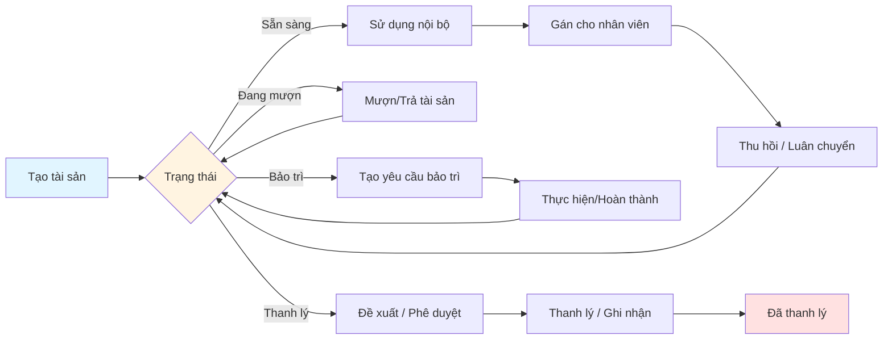

</details>

<details>
<summary><h3>📝 5.2. Lending Process with Approval</h3></summary>

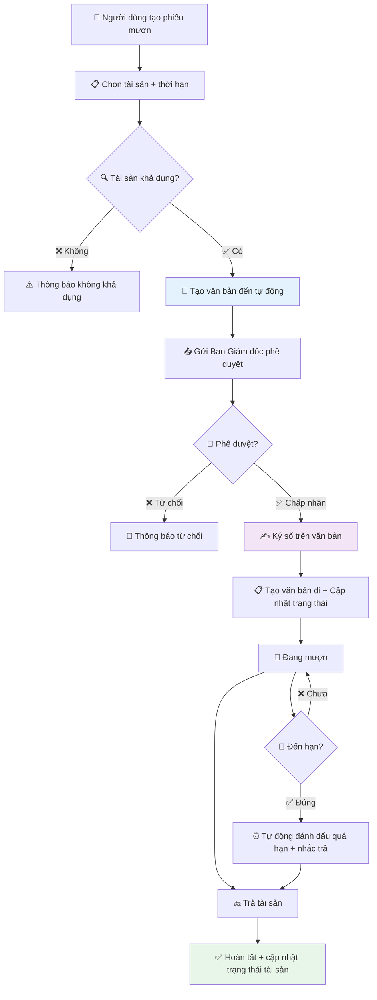

</details>

<details>
<summary><h3>🔧 5.3. Maintenance & Automation</h3></summary>

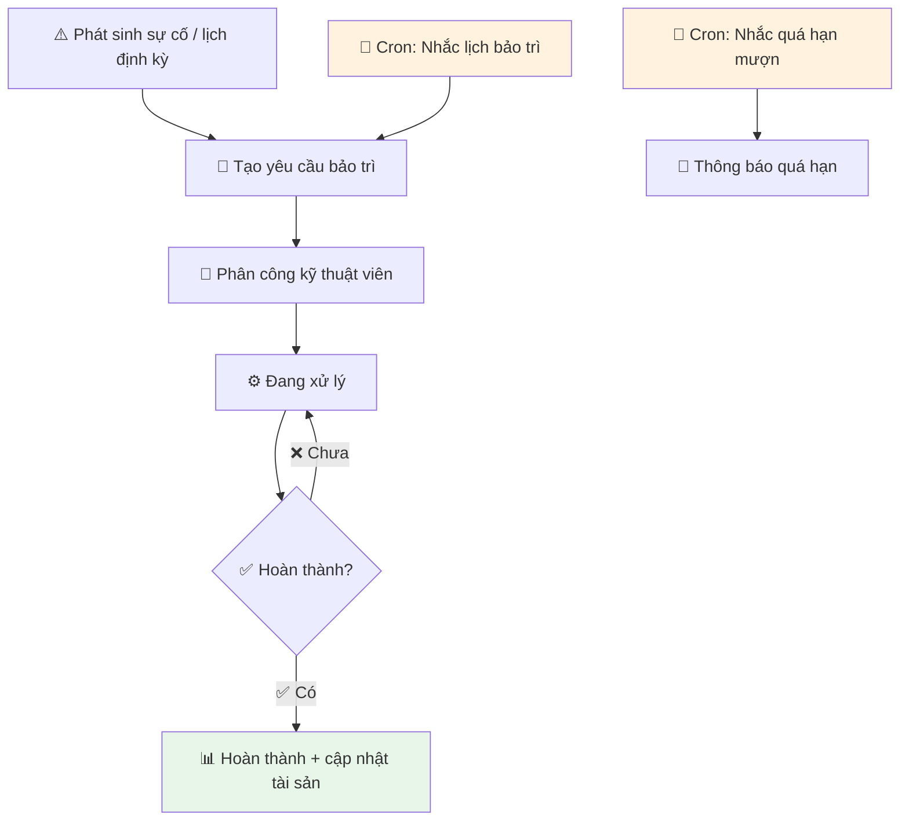

</details>

<details>
<summary><h3>📅 5.4. Meeting Booking + AI + Integrations</h3></summary>

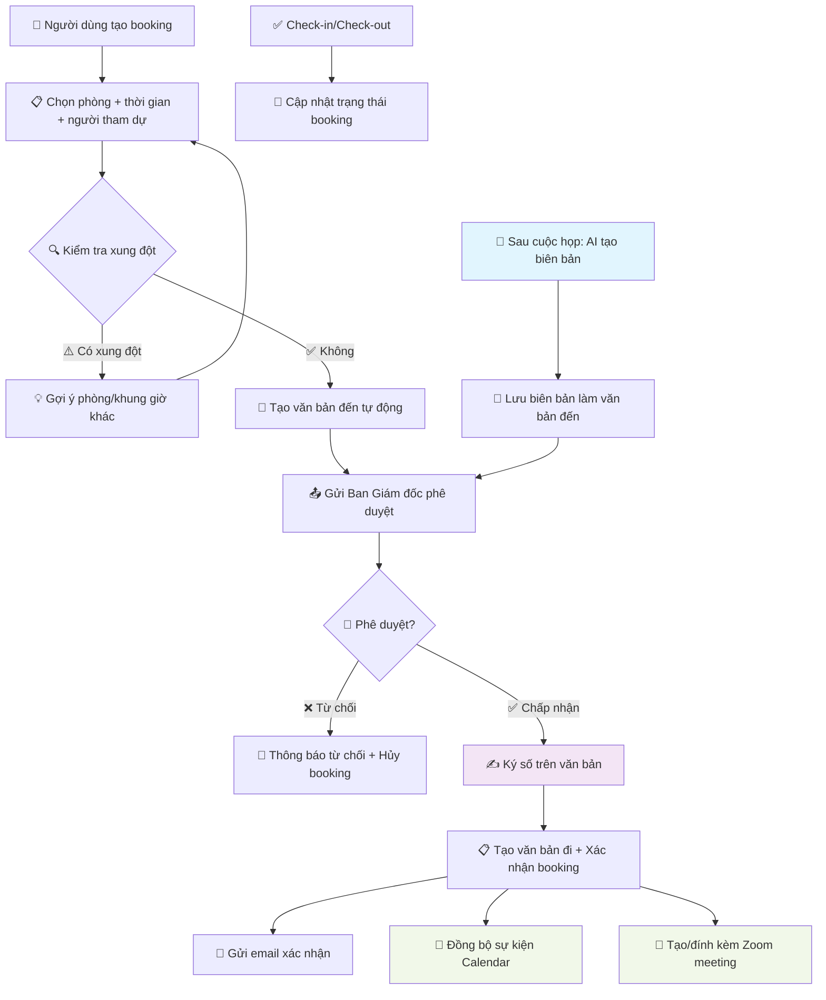

</details>

<details>
<summary><h3>📄 5.5. Document Flow with Digital Signature</h3></summary>

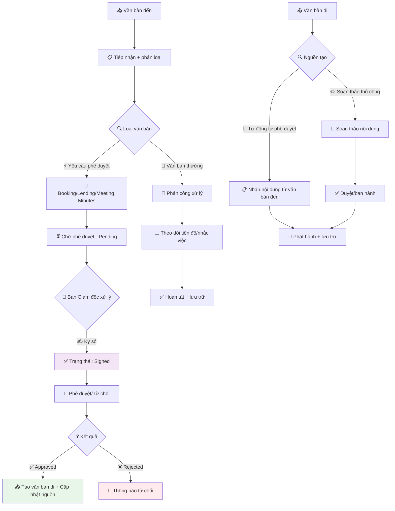

</details>

<details>
<summary><h3>👥 5.6. HR Core Workflow</h3></summary>

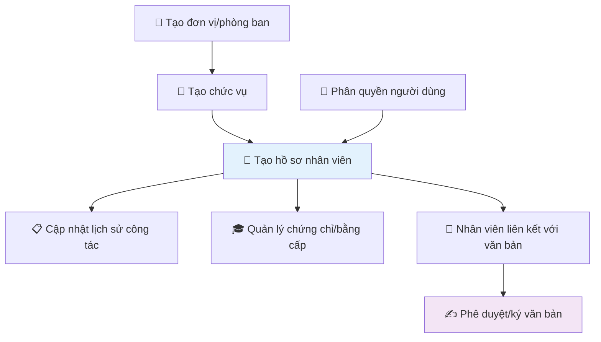

</details>

<details>
<summary><h3>🤖 5.7. AI Workflow - Meeting Minutes</h3></summary>

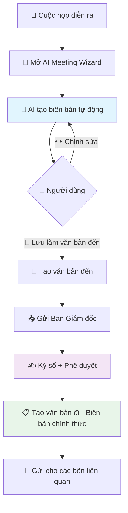

</details>

---

## ⭐ 6. Key Features

<table>
<tr>
<td width="50%" valign="top">

### 🔄 Automated Approval Workflow

```
Request → Document → Approve → Execute
   ↓         ↓          ↓         ↓
 User    Auto-gen   E-sign    Update
```

**Benefits:**
- ✅ Giảm thời gian xử lý 80%
- ✅ Loại bỏ sai sót thủ công
- ✅ Truy vết đầy đủ lịch sử
- ✅ Thông báo real-time

</td>
<td width="50%" valign="top">

### 🔐 Digital Signature

```
┌─────────────────────────┐
│  ✍️  Draw Signature     │
│  ⏱️  Timestamp          │
│  👤 User Authentication │
│  🏢 Department Link     │
└─────────────────────────┘
```

**Features:**
- ✅ Vẽ chữ ký trực tiếp
- ✅ Xác thực người ký
- ✅ Lưu kèm timestamp
- ✅ Không thể chỉnh sửa

</td>
</tr>
<tr>
<td width="50%" valign="top">

### 🤖 AI-Powered Assistant

| AI Feature | Use Case |
|------------|----------|
| 📝 **Minutes** | Tạo biên bản cuộc họp |
| 🕐 **Scheduling** | Gợi ý thời gian phù hợp |
| 📋 **Agenda** | Tạo nội dung chương trình |
| 💬 **Chatbot** | Trợ lý ảo hỗ trợ 24/7 |

Powered by **OpenAI GPT-4**

</td>
<td width="50%" valign="top">

### ⚡ Smart Automation

**Automated Tasks:**
```python
# Auto reminders
✓ Maintenance schedule
✓ Overdue asset lending
✓ Document deadlines

# Auto updates
✓ Booking status
✓ Document workflow
✓ Email notifications
```

**Cron Jobs:** Every 1 hour

</td>
</tr>
<tr>
<td colspan="2" valign="top">

### 🔗 Multi-Platform Integration

<table width="100%">
<tr>
<td width="25%" align="center">

<br><strong>Google Calendar</strong>
<br><small>Sync events</small>
</td>
<td width="25%" align="center">

<br><strong>Zoom</strong>
<br><small>Auto meeting link</small>
</td>
<td width="25%" align="center">

<br><strong>Email</strong>
<br><small>SMTP notifications</small>
</td>
<td width="25%" align="center">

<br><strong>OpenAI</strong>
<br><small>GPT-4 integration</small>
</td>
</tr>
</table>

</td>
</tr>
</table>

---
## ⚙️ 8. Installation Guide

> 🚀 *Hướng dẫn cài đặt từ A-Z*

### 📋 7.1. System Requirements

<table>
<tr>
<th width="30%">Component</th>
<th width="70%">Requirement</th>
</tr>
<tr>
<td><strong>OS</strong></td>
<td>Ubuntu 20.04+ / Debian 11+ / WSL2</td>
</tr>
<tr>
<td><strong>Python</strong></td>
<td>3.10</td>
</tr>
<tr>
<td><strong>PostgreSQL</strong></td>
<td>12+ (via Docker recommended)</td>
</tr>
<tr>
<td><strong>RAM</strong></td>
<td>Minimum: 4GB | Recommended: 8GB+</td>
</tr>
<tr>
<td><strong>Storage</strong></td>
<td>Minimum: 10GB free space</td>
</tr>
<tr>
<td><strong>Browser</strong></td>
<td>Chrome 90+ / Firefox 88+ / Edge 90+</td>
</tr>
</table>

---

### 🔧 7.2. Quick Start

#### Step 1️⃣: Clone Repository

```bash
git clone https://gitlab.com/anhlta/odoo-fitdnu.git
cd odoo-fitdnu
```

#### Step 2️⃣: Install System Dependencies

```bash
sudo apt-get update && sudo apt-get install -y \
    libxml2-dev libxslt-dev libldap2-dev libsasl2-dev \
    libssl-dev python3.10-distutils python3.10-dev \
    build-essential libffi-dev zlib1g-dev python3.10-venv \
    libpq-dev wkhtmltopdf
```

#### Step 3️⃣: Setup Python Virtual Environment

```bash
# Create virtual environment
python3.10 -m venv ./venv

# Activate
source venv/bin/activate  # Linux/Mac
# or
.\venv\Scripts\activate   # Windows

# Install Python packages
pip3 install --upgrade pip
pip3 install -r requirements.txt
```

#### Step 4️⃣: Setup Database with Docker

```bash
# Install Docker (if not installed)
sudo apt-get install docker.io docker-compose
sudo systemctl start docker
sudo systemctl enable docker

# Start PostgreSQL container
sudo docker-compose up -d

# Verify container is running
sudo docker ps
```

<details>
<summary><strong>📦 Docker Compose Configuration</strong></summary>

```yaml
version: '3'
services:
  postgres:
    image: postgres:14
    environment:
      POSTGRES_USER: odoo
      POSTGRES_PASSWORD: odoo
      POSTGRES_DB: postgres
    ports:
      - "5431:5432"
    volumes:
      - postgres_data:/var/lib/postgresql/data

volumes:
  postgres_data:
```

</details>

#### Step 5️⃣: Configure Odoo

```bash
# Copy configuration template
cp odoo.conf.template odoo.conf
```

**Edit `odoo.conf`:**

```ini
[options]
addons_path = addons
db_host = localhost
db_password = odoo
db_user = odoo
db_port = 5431
xmlrpc_port = 8069
limit_time_cpu = 600
limit_time_real = 1200
workers = 2
```

#### Step 6️⃣: Initialize Database

```bash
# First time setup - Install base modules
./odoo-bin -c odoo.conf -d fitdnu_db \
  -i base,nhan_su,quan_ly_van_ban,dnu_meeting_asset

# Wait for installation to complete...
```

#### Step 7️⃣: Start Odoo Server

```bash
# Normal mode
./odoo-bin -c odoo.conf

# Development mode (with auto-reload)
./odoo-bin -c odoo.conf --dev=all
```

#### Step 8️⃣: Access System

```
🌐 URL:      http://localhost:8069
💾 Database: fitdnu_db
👤 Username: admin
🔑 Password: admin
```

---

### 🔌 7.3. Configure Integrations

<details>
<summary><h4>🤖 OpenAI Integration</h4></summary>

1. Login to Odoo as **admin**
2. Go to **Settings → Technical → OpenAI Configuration**
3. Enter your OpenAI API Key
4. Select model: `gpt-4` or `gpt-3.5-turbo`
5. Click **Save** and **Test Connection**

```python
# Get API key from: https://platform.openai.com/api-keys
OPENAI_API_KEY = "sk-..."
```

</details>

<details>
<summary><h4>📅 Google Calendar Integration</h4></summary>

1. Go to **Settings → Integrations → Google Calendar**
2. Create OAuth2 credentials at [Google Cloud Console](https://console.cloud.google.com/)
3. Configure callback URL: `http://localhost:8069/google_calendar/authentication`
4. Enter Client ID and Client Secret
5. Click **Connect** and authorize

</details>

<details>
<summary><h4>🎥 Zoom Integration</h4></summary>

1. Create Zoom App at [Zoom Marketplace](https://marketplace.zoom.us/)
2. Get API Key and API Secret
3. In Odoo: **Settings → Integrations → Zoom**
4. Enter credentials and activate

</details>

<details>
<summary><h4>📧 Email Server Configuration</h4></summary>

1. Go to **Settings → Technical → Outgoing Mail Servers**
2. Create new server with SMTP details:

```ini
SMTP Server: smtp.gmail.com
SMTP Port: 587
Security: TLS
Username: your-email@gmail.com
Password: app-password
```

3. Click **Test Connection**

</details>

---

### 🔄 7.4. Update & Maintenance

```bash
# Update module after code changes
./odoo-bin -c odoo.conf -d fitdnu_db -u dnu_meeting_asset --stop-after-init

# Update multiple modules
./odoo-bin -c odoo.conf -d fitdnu_db \
  -u dnu_meeting_asset,quan_ly_van_ban --stop-after-init

# Clear cache
rm -rf ~/.local/share/Odoo/sessions/*

# Restart Odoo
# Press Ctrl+C to stop, then start again
```

---

## 📚 8. User Guide

> 💡 *Hướng dẫn sử dụng các tính năng chính*

<details open>
<summary><h3>📅 8.1. Meeting Room Booking with Approval</h3></summary>

#### Step-by-Step Guide

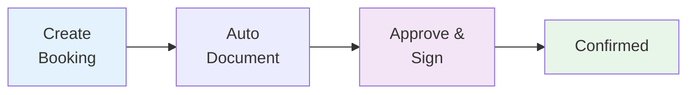

**Detailed Steps:**

1. **Create Booking**
   - Navigate to: `Meeting Room → Create Booking`
   - Fill in: Room, Date/Time, Participants
   - Add meeting purpose and notes

2. **Automatic Process**
   - System creates incoming document automatically
   - Sends notification to Board of Directors
   - Document code: `YC/2026/xxxx`

3. **Approval**
   - Board accesses: `Incoming Documents`
   - Reviews booking details
   - Signs digitally and approves/rejects

4. **Confirmation**
   - System creates outgoing document: `PD/2026/xxxx`
   - Updates booking status → `Confirmed`
   - Sends email confirmation
   - Syncs with Google Calendar
   - Creates Zoom meeting link

</details>

<details>
<summary><h3>🤖 8.2. AI Meeting Minutes Generation</h3></summary>

#### Using AI Assistant

1. **Open AI Wizard**
   ```
   Meeting Room → [Select Meeting] → AI Meeting Wizard
   ```

2. **Generate Minutes**
   - Select: "Create Meeting Minutes"
   - AI analyzes: participants, time, room, purpose
   - Generates complete minutes automatically

3. **Review & Edit**
   - Review AI-generated content
   - Edit if needed
   - Add additional notes

4. **Save as Document**
   - Click: "Save as Incoming Document"
   - Document sent to Board for approval
   - After approval → Official document created

**AI Features:**
| Feature | Description |
|---------|-------------|
| 📝 Smart Content | AI understands context and generates appropriate content |
| 🎯 Structured Format | Follows official meeting minutes format |
| ⚡ Fast | Generates in seconds |
| 🔄 Editable | Can be modified before saving |

</details>

<details>
<summary><h3>✍️ 8.3. Digital Signature</h3></summary>

#### Signing Documents

```
┌──────────────────────────────────┐
│   Draw your signature here       │
│                                  │
│   [Signature Canvas]             │
│                                  │
│   [Clear] [Save]                 │
└──────────────────────────────────┘
```

**How to Sign:**

1. Open document requiring signature
2. Click **"Sign"** button
3. Draw signature using mouse/touchscreen
4. Click **"Save"**
5. Signature is saved with:
   - ✅ Timestamp
   - ✅ User authentication
   - ✅ Department linkage
   - ✅ Cannot be edited

</details>

<details>
<summary><h3>📦 8.4. Asset Lending with Approval</h3></summary>

#### Lending Process

| Step | Action | System Response |
|------|--------|-----------------|
| 1️⃣ | Create lending request | Check asset availability |
| 2️⃣ | Select asset & duration | Auto-create document |
| 3️⃣ | Wait for approval | Notification sent |
| 4️⃣ | Board approves | Asset status → "Lending" |
| 5️⃣ | Use asset | Auto-reminder before due |
| 6️⃣ | Return asset | Status → "Available" |

**Auto-Reminders:**
- 📧 3 days before due date
- 📧 On due date
- 📧 After overdue (daily)

</details>

<details>
<summary><h3>⚡ 8.5. Quick Approval</h3></summary>

#### Approve from List View

**For Bookings:**
```
Meeting Room → Bookings → Filter: Pending
→ Click [Approve] or [Reject]
→ Enter reason (if rejecting)
→ Done!
```

**For Lending:**
```
Assets → Lending Requests → Filter: Pending
→ Click [Approve] or [Reject]
→ System updates automatically
```

**Benefits:**
- ⚡ No need to open document
- 🚀 Batch approval possible
- 📊 Real-time status update
- 📧 Auto-notification

</details>

---

## 🏗️ 9. Project Structure

```
Business-Internship/
│
├── 📁 addons/                       # Custom Odoo Modules
│   │
│   ├── 📦 nhan_su/                  # HR Management Module
│   │   ├── models/                  # Python models
│   │   │   ├── chuc_vu.py          # Position model
│   │   │   ├── don_vi.py           # Department model
│   │   │   ├── nhan_vien.py        # Employee model
│   │   │   └── lich_su_cong_tac.py # Work history
│   │   ├── views/                   # XML views
│   │   ├── security/                # Access rights
│   │   │   ├── ir.model.access.csv
│   │   │   └── security.xml
│   │   └── data/                    # Master data
│   │
│   ├── 📦 quan_ly_van_ban/          # Document Management
│   │   ├── models/
│   │   │   ├── van_ban_den.py      # Incoming documents + approval
│   │   │   ├── van_ban_di.py       # Outgoing documents
│   │   │   └── van_ban_task.py     # Task reminders
│   │   ├── wizards/
│   │   │   └── van_ban_sign_wizard.py  # Digital signature wizard
│   │   ├── views/
│   │   │   ├── van_ban_den_views.xml
│   │   │   └── van_ban_di_views.xml
│   │   └── data/
│   │       └── sequence.xml         # Document numbering
│   │
│   └── 📦 dnu_meeting_asset/        # Asset & Meeting Module
│       ├── models/
│       │   ├── dnu_asset.py         # Asset management
│       │   ├── dnu_meeting_booking.py  # Meeting booking
│       │   ├── dnu_asset_lending.py    # Asset lending
│       │   ├── openai_service.py    # OpenAI integration
│       │   └── ai_history.py        # AI request logs
│       ├── wizards/
│       │   └── ai_wizard.py         # AI assistant wizard
│       ├── views/
│       │   ├── dnu_meeting_booking_views.xml
│       │   ├── dnu_asset_views.xml
│       │   └── ai_wizard_views.xml
│       ├── data/
│       │   └── openai_data.xml      # OpenAI config
│       ├── static/src/
│       │   ├── js/
│       │   │   └── signature_widget.js  # Signature widget
│       │   └── css/
│       │       └── signature_widget.css
│       └── security/
│           ├── ir.model.access.csv
│           └── security.xml
│
├── 📁 odoo/                         # Odoo Core Framework
├── 📁 doc/                          # Official Documentation
├── 📁 docs/                         # Project Documentation
│   ├── logo/                        # Logos & Images
│   └── projects/                    # Student Projects
│       └── K15/                     # Year 2024 projects
│
├── 📄 odoo-bin                      # Odoo Executable
├── 📄 odoo.conf                     # Configuration File
├── 📄 docker-compose.yml            # Docker PostgreSQL Setup
├── 📄 requirements.txt              # Python Dependencies
└── 📄 README.md                     # This File
```

### 📦 Module Dependencies

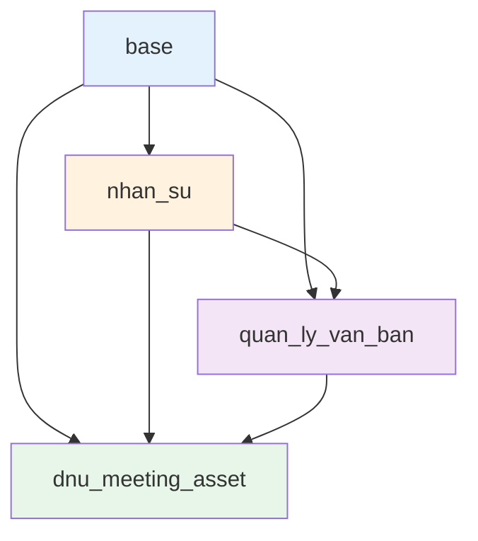

---

## 🔐 10. Access Control & Permissions

<table>
<tr>
<th colspan="2" align="center">Asset & Meeting Management</th>
</tr>
<tr>
<td width="30%"><strong>Meeting User</strong></td>
<td width="70%">
✅ Create bookings<br>
✅ View own bookings<br>
❌ Cannot approve
</td>
</tr>
<tr>
<td><strong>Meeting Manager</strong></td>
<td>
✅ All Meeting User rights<br>
✅ Manage all bookings<br>
✅ Configure meeting rooms<br>
✅ View reports
</td>
</tr>
<tr>
<td><strong>Asset User</strong></td>
<td>
✅ Create lending requests<br>
✅ View own assets<br>
✅ Return borrowed assets<br>
❌ Cannot manage assets
</td>
</tr>
<tr>
<td><strong>Asset Manager</strong></td>
<td>
✅ All Asset User rights<br>
✅ Create/Edit assets<br>
✅ Assign assets to employees<br>
✅ Manage maintenance<br>
✅ View all reports
</td>
</tr>
</table>

<table>
<tr>
<th colspan="2" align="center">Document Management</th>
</tr>
<tr>
<td width="30%"><strong>Document User</strong></td>
<td width="70%">
✅ View documents<br>
✅ Search & filter<br>
❌ Cannot create/edit
</td>
</tr>
<tr>
<td><strong>Document Manager</strong></td>
<td>
✅ All Document User rights<br>
✅ Create/Edit documents<br>
✅ Assign tasks<br>
✅ Manage document flow<br>
❌ Cannot approve
</td>
</tr>
<tr>
<td><strong>Document Approver</strong><br><small>(Board of Directors)</small></td>
<td>
✅ All Document Manager rights<br>
✅ <strong>Digital Signature</strong><br>
✅ <strong>Approve/Reject requests</strong><br>
✅ Create outgoing documents
</td>
</tr>
</table>

<table>
<tr>
<th colspan="2" align="center">Human Resource Management</th>
</tr>
<tr>
<td width="30%"><strong>HR User</strong></td>
<td width="70%">
✅ View employee information<br>
✅ View departments<br>
❌ Cannot edit
</td>
</tr>
<tr>
<td><strong>HR Manager</strong></td>
<td>
✅ All HR User rights<br>
✅ Create/Edit employees<br>
✅ Manage departments<br>
✅ Manage positions<br>
✅ Work history tracking<br>
✅ Certificate management
</td>
</tr>
</table>

### 🔑 Special Permissions

| Permission | Required Role | Description |
|------------|---------------|-------------|
| **Digital Signature** | Document Approver | Only Board members can sign |
| **AI Features** | All Users | Anyone can use AI assistant |
| **Auto Document Creation** | System | Triggered by booking/lending |
| **Email Notifications** | System | Auto-sent to relevant users |

---

## 🧪 11. Testing & Quality Assurance

<details>
<summary><h3>🔍 Testing Approval Workflow</h3></summary>

```bash
# 1. Start test database
./odoo-bin -c odoo.conf -d test_db --test-enable

# 2. Test scenarios
```

**Test Cases:**

| # | Scenario | Expected Result |
|---|----------|-----------------|
| 1 | Create booking | Auto-create incoming document |
| 2 | Approve booking | Create outgoing document + update status |
| 3 | Reject booking | Send rejection notification |
| 4 | Create lending | Check asset availability |
| 5 | Overdue lending | Auto-reminder sent |
| 6 | AI meeting minutes | Generate content successfully |

</details>

<details>
<summary><h3>🤖 Testing AI Features</h3></summary>

**Steps:**

1. Configure OpenAI API key
2. Go to: `Settings → Technical → OpenAI Configuration`
3. Click **"Test Connection"**
4. Try each AI feature:
   - ✅ Meeting minutes generation
   - ✅ Smart scheduling
   - ✅ Agenda creation
   - ✅ AI chat
5. Check AI History for logs

**Verify:**
```python
# Check AI service status
Settings → Technical → AI History
→ View request/response logs
→ Check success rate
```

</details>

<details>
<summary><h3>✍️ Testing Digital Signature</h3></summary>

1. Open incoming document
2. Click **"Sign"** button
3. Draw signature
4. Save and verify:
   - ✅ Signature image saved
   - ✅ Timestamp recorded
   - ✅ User info linked
   - ✅ Cannot edit after saving

</details>

---

## 🐛 12. Troubleshooting

<details open>
<summary><h3>❌ Common Issues & Solutions</h3></summary>

#### 🔴 Database Connection Failed

```bash
# Check PostgreSQL container
sudo docker ps

# Expected output:
CONTAINER ID   IMAGE         STATUS
xxxxx          postgres:14   Up 10 minutes

# If not running:
sudo docker-compose up -d

# Check port:
sudo netstat -tulpn | grep 5431
```

#### 🔴 Module Not Loading

```bash
# Option 1: Upgrade module
./odoo-bin -c odoo.conf -d your_db -u module_name --stop-after-init

# Option 2: Clear cache
rm -rf ~/.local/share/Odoo/sessions/*
rm -rf ~/.local/share/Odoo/filestore/*

# Option 3: Reinstall
./odoo-bin -c odoo.conf -d your_db -i module_name --stop-after-init
```

#### 🔴 OpenAI Not Working

**Checklist:**
- ✅ API key configured correctly
- ✅ Internet connection available
- ✅ API key has credits
- ✅ Model name correct (`gpt-4` or `gpt-3.5-turbo`)

```bash
# Test API key manually
curl https://api.openai.com/v1/models \
  -H "Authorization: Bearer YOUR_API_KEY"

# Check Odoo logs
tail -f /var/log/odoo/odoo.log | grep -i "openai"
```

#### 🔴 Digital Signature Not Showing

```bash
# Clear browser cache
Ctrl + Shift + Delete

# Check JavaScript console
F12 → Console → Look for errors

# Upgrade module
./odoo-bin -c odoo.conf -d your_db -u quan_ly_van_ban --stop-after-init

# Check static files
ls -la addons/dnu_meeting_asset/static/src/js/
```

#### 🔴 Email Not Sending

**Check:**
1. SMTP server configured: `Settings → Technical → Outgoing Mail Servers`
2. Test connection in Odoo
3. Check firewall: port 587 or 465 open
4. Gmail users: Use app password, not regular password

</details>

<details>
<summary><h3>📊 Performance Optimization</h3></summary>

#### Database Optimization

```sql
-- Connect to PostgreSQL
sudo docker exec -it postgres_container psql -U odoo

-- Reindex database
REINDEX DATABASE your_db_name;

-- Vacuum analyze
VACUUM ANALYZE;

-- Check database size
SELECT pg_database.datname, 
       pg_size_pretty(pg_database_size(pg_database.datname)) AS size
FROM pg_database;
```

#### Odoo Configuration for Production

```ini
# odoo.conf - Production settings
[options]
workers = 4                      # CPU cores * 2
max_cron_threads = 2
limit_memory_hard = 2684354560   # 2.5 GB
limit_memory_soft = 2147483648   # 2 GB
limit_time_cpu = 600
limit_time_real = 1200
db_maxconn = 64
```

**Performance Tips:**
- ✅ Use workers > 0 for production
- ✅ Set memory limits to prevent crashes
- ✅ Regular database vacuum
- ✅ Monitor logs for slow queries
- ✅ Use PostgreSQL 14+ for better performance

</details>

---

## 🤝 13. Contributing Guide

> 🎯 *Hướng dẫn đóng góp cho dự án*

### 📝 Coding Standards

<table>
<tr>
<td width="50%">

**Python (PEP 8)**
```python
# Good ✅
class AssetLending(models.Model):
    _name = 'dnu.asset.lending'
    _description = 'Asset Lending'
    
    def action_approve(self):
        """Approve lending request"""
        self.state = 'approved'
```

</td>
<td width="50%">

**JavaScript (ES6+)**
```javascript
// Good ✅
const signatureWidget = {
    init() {
        this.canvas = document.getElementById('canvas');
        this.context = this.canvas.getContext('2d');
    },
    
    clear() {
        this.context.clearRect(0, 0, width, height);
    }
};
```

</td>
</tr>
</table>

**General Rules:**
- ✅ Use meaningful variable/function names
- ✅ Add docstrings for Python functions
- ✅ Comment complex logic
- ✅ Follow existing code style
- ✅ Write modular, reusable code

---

### 🔄 Git Workflow

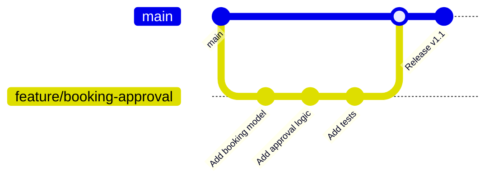

**Steps:**

```bash
# 1. Create feature branch
git checkout -b feature/your-feature-name

# 2. Make changes and commit
git add .
git commit -m "feat: add new feature description"

# 3. Push to remote
git push origin feature/your-feature-name

# 4. Create Merge Request on GitLab
# Go to: https://gitlab.com/anhlta/odoo-fitdnu
# Click: "Create Merge Request"
```

---

### 💬 Commit Message Convention

We follow **Conventional Commits** standard:

```
<type>(<scope>): <subject>

<body>

<footer>
```

**Types:**

| Type | Description | Example |
|------|-------------|---------|
| `feat` | New feature | `feat(asset): add lending approval` |
| `fix` | Bug fix | `fix(booking): resolve conflict check` |
| `docs` | Documentation | `docs(readme): update install guide` |
| `style` | Code formatting | `style: apply PEP8 formatting` |
| `refactor` | Code restructuring | `refactor(meeting): optimize query` |
| `test` | Add tests | `test(lending): add approval tests` |
| `chore` | Dependencies, configs | `chore: update requirements.txt` |
| `perf` | Performance improvement | `perf(asset): optimize search` |

**Examples:**

```bash
# Good ✅
git commit -m "feat(ai): add meeting minutes generator"
git commit -m "fix(signature): resolve canvas size issue"
git commit -m "docs: update API documentation"

# Bad ❌
git commit -m "update"
git commit -m "fix bug"
git commit -m "changes"
```

---

### 🧪 Testing Before Commit

**Checklist:**

```bash
# 1. Check Python syntax
python -m py_compile addons/your_module/**/*.py

# 2. Test module installation
./odoo-bin -c odoo.conf -d test_db -i your_module --stop-after-init

# 3. Test module upgrade
./odoo-bin -c odoo.conf -d test_db -u your_module --stop-after-init

# 4. Check for errors
tail -f odoo.log | grep -i error

# 5. Test in browser
# - Clear cache (Ctrl + Shift + Delete)
# - Test functionality
# - Check JavaScript console (F12)
```

---

### 📦 Pull Request Guidelines

**PR Title Format:**
```
[Module] Brief description

Example:
[dnu_meeting_asset] Add AI meeting minutes generation
[quan_ly_van_ban] Implement digital signature
```

**PR Description Template:**

```markdown
## Description
Brief description of what this PR does

## Changes
- Added feature X
- Fixed bug Y
- Updated documentation Z

## Screenshots
(If applicable, add screenshots)

## Testing
- [ ] Tested locally
- [ ] Module installs correctly
- [ ] No console errors
- [ ] All features working

## Related Issues
Closes #123
```

---

### 🎨 Code Review Checklist

**For Reviewers:**

- [ ] Code follows style guidelines
- [ ] Changes are well documented
- [ ] No hardcoded values
- [ ] Security: no SQL injection risks
- [ ] Performance: no N+1 queries
- [ ] i18n: strings are translatable
- [ ] Tests pass successfully
- [ ] Documentation updated

---

## 📞 14. Support & Community

<div align="center">

### 🌟 Get Help & Stay Connected

<table>
<tr>
<td align="center" width="25%">

<br><strong>Email</strong>
<br><a href="mailto:aiotlab@dainam.edu.vn">aiotlab@dainam.edu.vn</a>
</td>
<td align="center" width="25%">

<br><strong>Facebook</strong>
<br><a href="https://www.facebook.com/DNUAIoTLab">AIoTLab DNU</a>
</td>
<td align="center" width="25%">

<br><strong>Website</strong>
<br><a href="https://dainam.edu.vn">DaiNam University</a>
</td>
<td align="center" width="25%">

<br><strong>GitLab</strong>
<br><a href="https://gitlab.com/anhlta/odoo-fitdnu">odoo-fitdnu</a>
</td>
</tr>
</table>

---

### 📚 Resources

| Resource | Link |
|----------|------|
| **Odoo Documentation** | [📖 docs.odoo.com](https://www.odoo.com/documentation/17.0/) |
| **Python 3.10 Docs** | [📖 docs.python.org](https://docs.python.org/3.10/) |
| **PostgreSQL Guide** | [📖 postgresql.org](https://www.postgresql.org/docs/) |
| **OpenAI API** | [📖 platform.openai.com](https://platform.openai.com/docs) |

---

### 🐛 Report Issues

Found a bug? Have a suggestion?

1. Check [existing issues](https://gitlab.com/anhlta/odoo-fitdnu/-/issues)
2. If not found, [create new issue](https://gitlab.com/anhlta/odoo-fitdnu/-/issues/new)
3. Provide details:
   - Steps to reproduce
   - Expected vs actual behavior
   - Screenshots if applicable
   - Environment (OS, Python version, etc.)

---

### 💼 For Students

**Internship Opportunities:**
- 📧 Contact: aiotlab@dainam.edu.vn
- 📅 Duration: 12 weeks
- 🎯 Topics: ERP Development, AI Integration, Business Process

**Requirements:**
- Basic Python & JavaScript knowledge
- Interest in ERP systems
- Willing to learn Odoo framework

</div>

---

## 📜 15. License & Copyright

```
Copyright © 2024 AIoTLab
Faculty of Information Technology
DaiNam University

All rights reserved.
```

**License Information:**
- This project is proprietary software for educational purposes
- Based on Odoo Community Edition (LGPL v3)
- Custom modules are property of DaiNam University
- For commercial use, contact: aiotlab@dainam.edu.vn

---

## 🙏 16. Acknowledgments

**Special Thanks To:**

- 🎓 **DaiNam University** - For providing resources and support
- 👥 **Faculty of Information Technology** - For guidance and mentorship
- 🧑‍💻 **Odoo Community** - For the amazing open-source platform
- 🤖 **OpenAI** - For GPT-4 API integration
- 👨‍🎓 **Students** - For testing and feedback

---

<div align="center">

### ⭐ Star This Project

If you find this project helpful, please give it a ⭐ on GitLab!

[](https://gitlab.com/anhlta/odoo-fitdnu)

---

**Made with ❤️ by AIoTLab - DaiNam University**

*Last Updated: January 2026*

</div>

---

    
